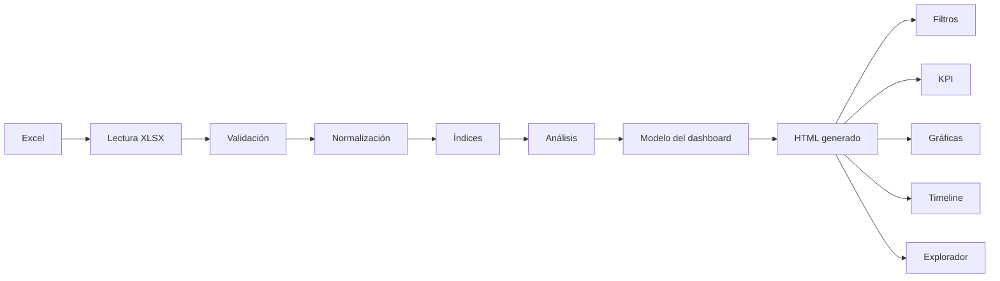
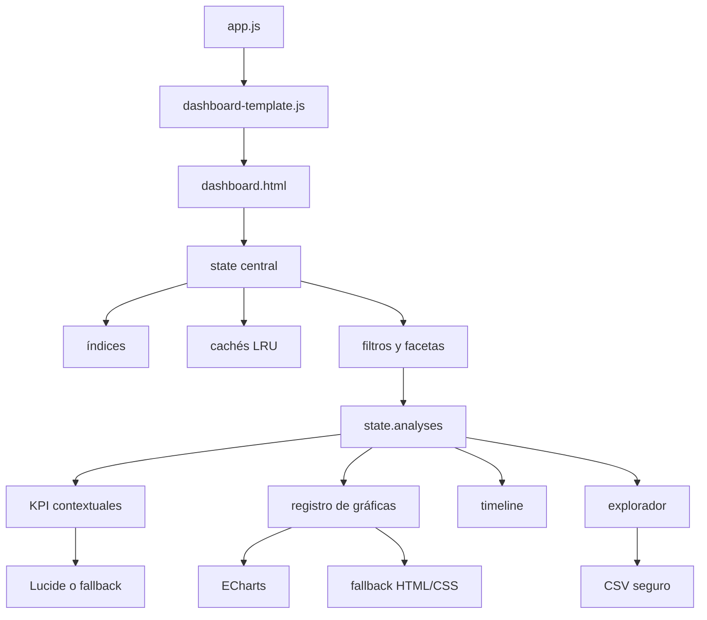

# Arquitectura

## Visión general

El proyecto es una aplicación web estática sin framework. Tiene dos etapas:

1. **Generador:** `index.html`, `styles.css` y `app.js` leen y procesan el workbook.
2. **Dashboard generado:** `dashboard-template.js` construye un HTML autocontenido con datos, CSS y JavaScript de interacción.

## Responsabilidades de `app.js`

- mantiene el estado de carga del generador;
- ejecuta `handleFile()` y evita que una lectura antigua reemplace una nueva;
- valida columnas mediante `validateColumns()`;
- normaliza filas con `normalizeRow()`;
- construye índices y análisis para calidad y previsualización;
- calcula métricas de control mediante `computeKpis()`;
- crea el payload entregado a `generateDashboardHtml()`;
- administra Blob URL de vista previa y descarga;
- muestra errores y advertencias acotados.

## Responsabilidades de `dashboard-template.js`

- `safeJson()` serializa datos sin permitir cierre del bloque `script`;
- `generateDashboardHtml()` ensambla documento, CDN, estilos y script;
- `dashboardCss()` define layout, temas, responsive y fallbacks;
- `dashboardScript()` contiene estado, índices, filtros, análisis y render;
- `initializeDashboardDataset()` limpia e inicializa un dataset;
- `buildDashboardAnalyses()` prepara el modelo compartido;
- `buildContextualKpiModel()` selecciona KPI según contexto;
- `getChartRegistry()` declara visualizaciones vigentes;
- `renderAdaptiveCharts()` y `renderRegisteredChart()` presentan gráficas;
- `buildNegotiationTimelineAnalysis()` construye el modelo temporal;
- el explorador y las exportaciones CSV viven dentro del mismo script generado.

## Componentes y conexiones

## Estado central

En el generador, `state` conserva archivo, workbook, hoja, filas, validación, índices, calidad, HTML y versiones de procesamiento.

En el dashboard generado, `state` conserva filtros, filas de alcance, filas filtradas, `analyses`, índices, versión del dataset, cachés, firmas visuales, scheduler, estado de filtros, diagnósticos y explorador. El DOM presenta el estado; no es su fuente de datos.

## Índices y análisis

`buildIndexes()` crea mapas por campos de filtro, actividad, cliente, período y relaciones. `buildActivityAnalytics()` resuelve objetivos, relaciones y desempeño. `buildDashboardAnalyses()` integra KPI, dimensiones, presentaciones, categorías y timeline.

El nuevo KPI usa `kpis.comparableSales`, que ya proviene de `aggregateActivityPerformance()`. No abre un recorrido adicional sobre las filas.

## Render y ciclo de vida

`scheduleDashboardRender()` incrementa una versión y coordina la actualización mediante `requestAnimationFrame`. Si llega una interacción más reciente, el render obsoleto se cancela o se ignora. `renderAll()` actualiza contexto, KPI, filtros, gráficas y explorador desde el mismo análisis.

Las instancias ECharts viven en `chartInstances`. Se reutilizan cuando la tarjeta sigue presente, se actualizan con `setOption()` y se liberan con `disposeChartInstance()` cuando desaparecen. `chartSignatures` evita actualizaciones idénticas.

## Dependencias y fallbacks

- **SheetJS:** lectura del workbook en el generador.
- **ECharts:** visualizaciones del HTML generado.
- **Lucide:** iconos.
- **GeoJSON externo:** mapa regional, con ranking nativo si falla.
- **HTML/CSS nativo:** fallback para gráficas, timeline e iconos.

No hay dependencias npm: `package.json` solo declara scripts de prueba y auditoría.

## Exportaciones y pruebas

El generador descarga el HTML mediante Blob. El dashboard exporta CSV general y del explorador con BOM UTF-8, escape y protección de fórmulas.

Las pruebas cargan `app.js` y el script generado en contextos de Node, validan casos sintéticos y reales y compilan el HTML completo. Los detalles están en [Pruebas y QA](13_PRUEBAS_Y_QA.md).
