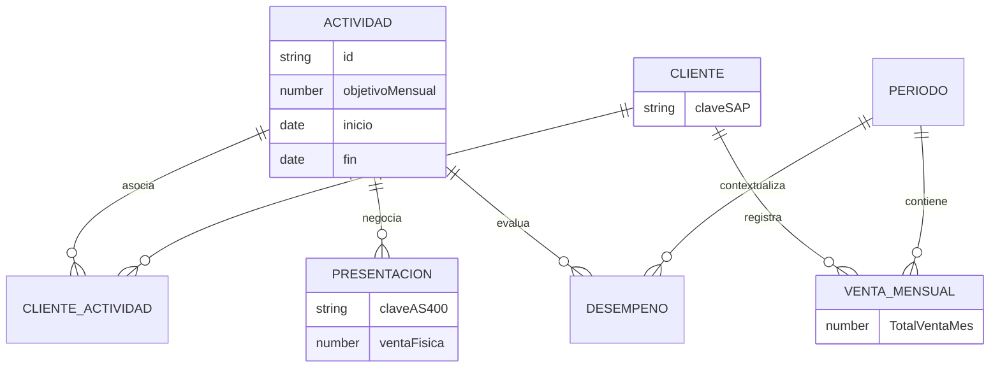

# Modelo de datos

## Clasificación de columnas

`app.js` reconoce el esquema de 28 columnas de `INSUMO DASHBOARD (3).xlsx` y lo adapta a un contrato interno estable.

- **Obligatorias:** Año, Mes, Cliente SAP, venta física, `TotalVentaMes`, objetivo mensual, actividad, fecha de inicio y fecha de fin.
- **Analíticas opcionales:** Año Mes, canal, categoría, texto/clave de presentación, región, objetivo total y CEDI.
- **Informativas:** las restantes, como centro, NIT, tipología, nombres, tipo y porcentaje de descuento y período de negociación.

Una columna obligatoria ausente bloquea el procesamiento. Una opcional ausente desactiva o reduce la dimensión correspondiente sin inventar datos.

## Diccionario principal

| Campo | Uso | Granularidad conceptual | Obligatorio | Ejemplo |
| --- | --- | --- | --- | --- |
| Año | Construir período canónico | fila/período | Sí | 2026 |
| Mes | Construir período canónico | fila/período | Sí | JUN |
| Año Mes | Respaldo y validación del período | fila/período | No | 202606 |
| Cliente SAP - Clave | Identidad de cliente | cliente | Sí | 1002559342 |
| ID Actividad | Identidad de negociación | actividad | Sí | 947124 |
| Presentación AS400 - Clave | Deduplicación de presentación | presentación | No | P-001 |
| Presentación AS400 - Texto | Etiqueta y búsqueda | presentación | No | Producto 500 ml |
| Ventas cajas físicas (sin rep) | Atribución granular | cliente + actividad + presentación + período | Sí | 371 |
| TotalVentaMes | Venta general | cliente + período | Sí | 67.401 |
| Objetivo mes | Objetivo comparable | actividad | Sí | 1.100 |
| Objetivo cajas total | Información contractual adicional | actividad | No | 12.000 |
| Fecha inicio | Vigencia | actividad | Sí | 2026-07-01 |
| Fecha fin | Vigencia | actividad | Sí | 2026-12-31 |
| Región SAP | Contexto y filtro | cliente/fila | No | Centro Sur |
| Canal | Contexto y filtro | cliente/fila | No | Tradicional |
| Categoría AS400 de la venta | Composición | presentación | No | Gaseosa |
| Cedi | Dimensión de cumplimiento | actividad/fila | No | Bogotá |
| % De inversión | Condición económica | actividad | No | 0,15 |
| Porcentaje descuento negociación | Condición por presentación | actividad/presentación | No | 0,10 |
| Porcentaje descuento venta | Atributo informativo | fila | No | 0,08 |
| Porcentaje descuento mes | Condición mensual | cliente + actividad + período | No | 0,185 |

## Tipos y normalización

`NUMERIC_COLUMNS`, `TEXT_COLUMNS` y `DATE_COLUMNS` controlan la conversión. Una venta física vacía se normaliza a cero para clasificar la presentación; un `TotalVentaMes` vacío permanece ausente. `TotalVentaMes` admite punto o coma decimal cuando llega como texto. Las fechas se normalizan a `YYYY-MM-DD`.

Los alias de encabezado aceptan variaciones conocidas, por ejemplo `Objetivo mes` sin espacio final y `Total venta mes`.

## Período canónico

El período usa Año y Mes y se representa internamente como `AAAAMM`, por ejemplo `202606`. `Año Mes` es respaldo, no la única fuente. Esto evita interpretar erróneamente valores como `52026` al cruzar años.

## Relaciones conceptuales

En palabras:

- una actividad puede tener muchos clientes;
- un cliente puede tener muchas actividades;
- una actividad puede negociar muchas presentaciones;
- `TotalVentaMes` pertenece a cliente + período;
- el objetivo mensual pertenece a actividad;
- la venta atribuible puede requerir cliente + actividad + presentación + período.

## Valores ausentes y conflictos

Ausente no significa cero. Los resolutores devuelven estados como `SIN_VALOR` o `CONFLICTO`. Las actividades con venta ambigua, fechas conflictivas u objetivo conflictivo permanecen visibles para revisión, pero no se incluyen silenciosamente en el cumplimiento comparable.

## Adaptador y modelos de la Fase 10A

`normalizeWorkbookRow()` devuelve aliases como `year`, `month`, `periodKey`, `periodLabel`, `periodDate`, `periodOrder`, `clientSap`, `clientName`, `activityId`, `physicalSales`, `monthlyObjective`, `totalObjective`, `investmentPercentage`, `monthlyDiscountPercentage` y `totalMonthlySales`. Las vistas actuales siguen recibiendo los encabezados originales para mantener compatibilidad.

`Año Mes` acepta `52026`, `62026`, `202605` y variantes con separador. La clave siempre queda como `AAAAMM`; la etiqueta de negocio usa `MAY 2026` y la fecha canónica el primer día del mes. No hay una lista fija de meses.

Las filas con cliente y actividad pero sin período no se eliminan. Reciben `periodStatus: SIN_PERIODO_DE_VENTA` y `evaluationStatus: NO_EVALUABLE`; región, canal o venta ausentes permanecen ausentes.

### Granularidades nuevas

| Modelo | Clave | Finalidad |
| --- | --- | --- |
| `salesByClientPeriod` | cliente + período | Venta general mensual sin duplicar presentaciones o actividades. |
| Venta física resuelta | cliente + actividad + período + presentación | Fuente granular de atribución. |
| `clientActivitySummary` | cliente + actividad | Fuente de la futura tabla detallada y navegación. |
| `clientSummary` | cliente | Resumen compacto derivado de relaciones y objetivos únicos. |

Cada relación contiene `navigation: { clientSap, activityId }`. `summaryTableColumns` parte de 17 columnas base y agrega `sales_<AAAAMM>`, `discount_<AAAAMM>`, `compliance_<AAAAMM>` y `status_<AAAAMM>` por cada elemento de `availablePeriods`.

`monthlyComplianceByMonth` y `monthlyStatusByMonth` conservan el resultado de cada período. `selectedMonthlyCompliance`, `selectedMonthlyStatus` y `selectedStatusPeriod` son una proyección para la tabla compacta. `totalProgress`, `totalDifference` y `totalObjectiveStatus` mantienen el avance contractual acumulado sin reemplazar el estado mensual.

Continúa con [Reglas de negocio](04_REGLAS_DE_NEGOCIO.md).
