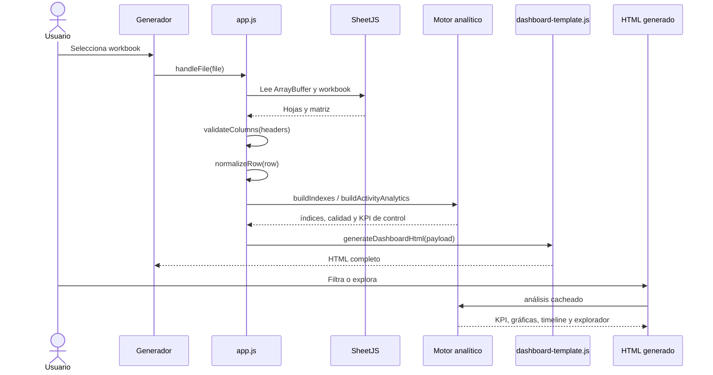

# Flujo de procesamiento

## Secuencia general

## 1. Selección del archivo

`handleFile()` en `app.js` recibe el archivo, incrementa `loadVersion` y lee el contenido. Si otra carga empieza antes de terminar, la versión antigua no puede sobrescribir el estado nuevo.

## 2. Lectura del workbook

SheetJS convierte el archivo en workbook. La UI permite seleccionar hoja. Las filas completamente vacías se ignoran y se contabilizan.

## 3. Validación de columnas

`validateColumns()` usa `buildHeaderMap()` y alias conocidos. Devuelve faltantes obligatorias, opcionales, informativas y extras. Una falta obligatoria detiene el proceso antes de generar cientos de valores indefinidos.

## 4. Normalización

`normalizeRow()`:

- convierte encabezados a nombres canónicos;
- normaliza texto y marcadores vacíos;
- interpreta números según la columna;
- normaliza fechas;
- construye `__periodKey`;
- registra advertencias de fila;
- conserva cero cuando es analíticamente válido.

## 5. Período canónico

`getYearMonthSortValue()` prioriza Año + Mes y usa Año Mes como respaldo validado. El resultado entero `AAAAMM` permite ordenar y comparar meses.

## 6. Índices

`buildIndexes()` prepara mapas por filtros, actividad, cliente y período, además de:

- clientes por actividad;
- actividades por cliente;
- presentaciones por actividad;
- metadatos de cliente;
- catálogos buscables;
- categoría resuelta.

Se construyen una vez por dataset.

## 7. Resolución de ventas generales

`resolveMetricGroups()` agrupa `TotalVentaMes` mediante `getClientPeriodKey()`. `sumResolvedMetricGroups()` suma únicamente grupos resueltos. Esto alimenta `salesPeriod` y `salesMonth`.

## 8. Resolución de objetivos

`buildActivityAnalytics()` resuelve objetivos y fechas por actividad. Conflictos quedan explícitos y no se sustituyen por una elección automática.

## 9. Relaciones cliente-actividad

El mismo análisis crea `activityClientRelations`. Estas relaciones determinan si una actividad es individual o compartida y permiten seleccionar contribuciones.

## 10. Venta atribuible

Para relaciones simples puede usarse `TotalVentaMes` de cliente-período. En relaciones simultáneas se intenta la venta física granular. `buildActivityAnalytics()` genera `activityPerformance` con venta, fuente, contribuciones, objetivo, fechas, estado y comparabilidad.

## 11. Comparabilidad

Una actividad participa si tiene fechas válidas, está vigente en el período, tiene objetivo válido y venta atribuible no ambigua. `aggregateActivityPerformance()` produce totales comparables.

## 12. KPI

`computeKpis()` combina ventas generales, agregado de actividades y presentaciones. `buildContextualKpiModel()` elige la matriz correcta para global, actividades, clientes y combinaciones. El KPI comparable reutiliza `kpis.comparableSales`.

## 13. Visualizaciones

`buildDashboardAnalyses()` prepara dimensiones y arreglos. `getChartRegistry()` decide visibilidad y metadatos; `renderAdaptiveCharts()` crea únicamente las tarjetas vigentes. La timeline es la única visualización temporal de negociación.

## 14. Generación de HTML

`generateDashboardHtml()` inserta datos mediante `safeJson()`, agrega CSS, markup, CDN y `dashboardScript()`. La salida contiene un único documento y un único script de datos/lógica embebido.

## 15. Vista previa y descarga

`processCurrentSheet()` evita procesos simultáneos. La vista previa usa una Blob URL que se revoca al reemplazarla. La descarga crea un nombre de archivo seguro.

## 16. Interacción dentro del dashboard

`initDashboard()` es idempotente. Una interacción llama `updateDashboardFilters()`, cambia la firma y programa `scheduleDashboardRender()`. `renderAll()` consume cachés e índices, actualiza `state.analyses` y sincroniza KPI, gráficas, timeline y explorador.

Al inicializar otro dataset, `initializeDashboardDataset()` cancela renders, libera gráficas, limpia cachés, filtros, modal, timeline y diagnósticos del dataset anterior.

## 17. Construcción del modelo para la futura tabla

Después de `normalizeWorkbookRow()` e `initializeProcessedDataIndexes()`, `processCurrentSheet()` invoca `buildClientNegotiationModels()` una sola vez. La función agrupa filas con `Map`, resuelve objetivos e inversión por actividad, `TotalVentaMes` por cliente–período, venta física por presentación, descuentos mensuales por relación y período y descuentos de negociación por sus valores conservados.

El resultado contiene `clientActivitySummary`, `clientSummary`, `availablePeriods`, `summaryTableColumns` y `diagnostics`. `buildMetadata()` lo entrega a `generateDashboardHtml()`; `safeJson()` mantiene la serialización segura. Dentro del HTML, `buildDashboardAnalyses()` lo expone en `state.analyses` sin reconstruirlo. Cargar otro archivo ejecuta `resetProcessedOutput()`, elimina el modelo previo e invalida las cachés del dashboard mediante un nuevo `datasetVersion`.

`projectClientNegotiationModelPeriod()` selecciona el mes indicado por `state.filters.Mes` y `state.filters.Año`; sin selección usa el último período disponible. Solo crea una proyección ligera de campos `selectedMonthly*`. Cumplimiento mensual y avance total ya están calculados y permanecen independientes.
