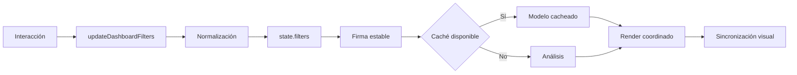

# Filtros y estado

## Una sola fuente de verdad

`state.filters` en el dashboard generado contiene el estado explícito. Los controles, chips y gráficas escriben allí mediante `updateDashboardFilters()`; después el render vuelve a proyectar ese estado en el DOM. Ningún análisis lee selecciones desde etiquetas HTML.

Los campos configurados en `FILTER_FIELDS` son:

- ID Actividad;
- Cliente SAP - Clave;
- Año;
- Mes;
- Región SAP;
- Canal;
- Categoría;
- Cedi;
- Estado de vigencia.

## Flujo de una interacción

## Normalización

`updateDashboardFilters()` elimina vacíos y duplicados, valida valores contra catálogos e ignora cambios cuya firma sea idéntica. Actividad y Cliente aceptan arreglos; otros controles se presentan como selección compacta.

`getFilterSignature()` ordena campos y valores antes de serializar. Seleccionar A/B o B/A genera la misma clave.

## Alcance y entidad

`getScopeFilters()` separa filtros de dimensión de Actividad/Cliente. `getEntityFilters()` conserva las entidades seleccionadas. Esto permite construir `activityAnalytics` sobre un ámbito estable y luego resolver la entidad sin que cada componente defina una población propia.

## Combobox

Actividad y Cliente usan el mismo componente declarativo (`MULTI_FILTER_CONFIGS`):

- selección múltiple;
- búsqueda preprocesada;
- navegación por teclado;
- opción resaltada;
- conteo y limpieza;
- dropdown fijo dentro del viewport.

El catálogo de cliente combina código, nombre, negocio y NIT en `searchText`. La búsqueda no recorre el workbook en cada tecla.

## Filtros facetados

`buildFacetedOptions()` calcula opciones disponibles respondiendo a los demás filtros y excluyendo temporalmente la dimensión que construye. La caché `facetedOptionsCache` tiene límite 12.

Una opción seleccionada se conserva aunque los demás filtros la dejen sin resultados; desaparece únicamente si se desmarca o deja de existir en el dataset.

## Chips y contexto derivado

Los chips de `renderActiveFilters()` son acciones removibles y representan únicamente filtros explícitos. El contexto derivado de `renderContextStrip()` informa período, tipo de actividad, cliente, región o registros sin aparentar ser un botón.

Ejemplo:

- chip: `Actividad: 947124 ×`;
- contexto: `Compartida entre 2 clientes`.

## Acciones desde gráficas y timeline

`applyChartFilter()` pasa por el mismo actualizador. Los clics de ECharts y fallbacks nativos nunca mutan filtros en paralelo. La timeline usa `handleTimelineAction()` para filtrar actividad o abrir el explorador.

## Scheduler y prevención de ciclos

`scheduleDashboardRender()` incrementa `renderVersion`. Un frame anterior no puede sobrescribir el filtro más reciente. `state.syncingControls` evita que la sincronización silenciosa de controles dispare cambios recursivos.

El resize usa un único `debouncedResizeCharts` de 160 ms y no recalcula análisis.

## Listeners delegados

Los contenedores estables reciben listeners una sola vez:

- panel de filtros;
- charts/timeline;
- overlay del explorador;
- window resize y teclado global controlado.

Las banderas `filterPanelEventsBound`, `detailExplorerEventsBound` y `dashboardInitialized` garantizan inicialización idempotente.

## Limpieza

`initializeDashboardDataset()` cancela el render pendiente, limpia filtros, facetas, firmas y cachés, libera gráficas y cierra el explorador. El tema puede conservarse como preferencia global, pero no las selecciones del workbook anterior.

## Estado local de seguimiento

`state.clientTrackingTable` mantiene estados mensual/total, orden, página, tamaño y relación seleccionada. No lee el DOM como fuente y no posee consulta local. Cliente, NIT, actividad, región, canal, categoría y CEDI se segmentan mediante los filtros globales; Mes define el período evaluado. Los controles locales de estado no cambian filtros globales. Solo **Ver cliente** y **Ver negociación** invocan `updateDashboardFilters()`, cierran el detalle y sincronizan chips, combobox y análisis.

## Navegación dentro del modal

`state.modalNavigation.stack` guarda cada nivel antes de abrir el siguiente: tipo de modal, cliente/actividad, página, orden, período, selección y scroll. **← Volver** restaura esa instantánea sin llamar a `updateDashboardFilters()` ni reconstruir el workbook. El nivel base conserva también la página, orden, fila seleccionada y posición del dashboard.
